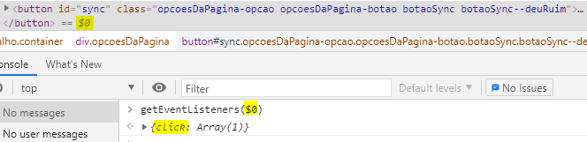

# Chrome DevTools
- Exibe erros de lógica;
- Navegador monta uma representação visual do DOM, represenatação de objetos armazenados em memória;

## Elements
- Representação de todos os elementos que temonos na página HTML inspecionada;
 
## Adicionar uma classe no no elemento selecinado
- Selecionar elemento dom a se incrementado;
- Em Styles, no canto superior direito, clickar .cls e descrever a classe;
-.cls pode-se ativar e desativar uma classe já existente;

## Styles -> Properties
- Visualizar as propriedades de cada elemento;
- Hierarquia; gi

## Significado cores ao passar mouse por cima do elemento
- Azul == tamanho do conteúdo do elemento 
- Verde == paddins 
- Laranja == margin

## Computed
- Representação dos valores convertidos para o nevegador de margin, border e paddin de do elemento selecionado;
- O valor não é o mesmo que está declarado no css, pois existem unidades de medida diferentes (em, px, %...). Desta forma, o valor contido na representação da aba Computed é igual a conversão do valor declarado. 

- Computed também possibilita a visualização de propriedades que nosso elemento aceita alteração. Diferenciando das propriedades aplicadas pela diferença de opacity;  

## Estilhos riscados no Style do navegador
- O risco por cima de algum comando de estilo no devtools, indica que tal estilo está sendo sobrescrito. Ou seja, o mesmo não está sendo utilizado ao renderizar a página;  

## MediaQuery 
- Defermina algum estilo de acordo de acordo com algum critério. Pode ser usado para manipular elementos de acordo com a resolução do usuário/navegador;  

## Erros de sitnaxe no CSS (visualizados no DevTools)
- Erros de sintaxe em alguma linha são indicados pelo simbolo :warning:

## Identificação da folha de estilo
- Devtools nos mostra qual arquivo contém o estilo aplicado em cada elemento;
- nome arquivo --> extensão --> linha;  

# Console

## Erros
- Erros são exibidos no console como um simbolo :x: antes da descrição.

## console.log()
- Exibe o que foi passado por parâmetro direto na aba console do DevTools;

## console.warn()
- Avisos para algo de errado acontece, porém não compromete a aplicação;

## console.assert(condição, "mensagem")
- Tipo mensagem exibida no console, para casos expecíficos;
- Ex: console.assert(x>10, "número maior que 10");

## console.group() console.groupEnd()
- Agrupa a exibição das mensagem, para facilitar a visulização/diferenciação de outras mensagens de erro;
- Ex: console.group("texto qualquer de identificação")
-     console.groupEnd();

- Todos os console.log's que estiventem entre o console.group e console,groupEnd, serão agrupados na aba console do DevTools.
- A exibição do group ao carregar a página é "aberta". 

## console.groupCollapsed()
- Mesma função do console.group(), porém a exibição default é grupo fechado. Ou seja, para exibi-lo é necessário clickar na seta antecedente a ele.

## console.table()
- Agurpa valores dentro de uma tabela;
- Sintaxe: console.table ([
    [dado1,dado2,dado3],
    [dado4,dado5,dado6]
])

- Passar alterar o nome da coluna, usa-se obejtos;
- Ex: console.table([
    {nome_coluna1:"dado_túpula1", nome_coluna2:"dado_túpula1"},
    {nome_coluna1:"dado_túpula2", nome_coluna2:"dado_túpula2"}
])

## DevTool Console Filter
- É possível filtrar as mensagens no console. Para acessar essa funcionalidade, basta clicka no icone de filtro;

## Filtro por Regex (Expressão regular);
- [0-9] == todas mensagens que possuem número de 0 a 9;
- {3} == todas mensagens que possuem no mínimo 3 números;

## Manter o histórico de Logs no console
- Para manter os logs no console do navegador, mesmo que a página seja recarregada, precisamos selecionar o check "Preserve log";  

## $_
 - Recupera o resultado do último comando executado no console;

## $0 (Copiar elementos da aba Elements para o Console)
- Selecionar o elemento desejado na aba Elements;
- Digitar $0 na aba Console e precionar Enter;

## $ Histórico
- $ guarda um histórico dos cinco últimos elementos acessados atráves do $0;
- Para acessar, basta alterar o número subsequente ao cifrão:
    - $1 == penúltimo; 
    - $2 == antepenúltimo;
    - ...
    - $4 == primeiro.

## $()
- Busca de dom no console, com uma sintaxe mais simplificada;  

## $$
- Busca todos os elementos passados como parâmetro;
- document.querySelectorAll() == $$()

## Histórico de comandos
- UpArrow acessa toda o histórico dos comandos anteriores;

## getEventListeners()
- Exibe todos os listeners contidos no elemetno passado como parâmetro;  

## Elements --> Event Listeners
- Aba Event Listeners exibe todos os listeners vinculados ao elemento selecionado;
- Caso o check "Ancestors" esteja selecionado, o listeners presentes na aba, estam vinculados ao elemento selecionado e/ou ao elemento pai do elemtento selecionado;
- Exibe o arquivo que contém o listener e a linha dele;

# Sources
- Vizualizar o código fonte de tudo que foi carregado no navegador;

## Visualizar no código fonte a linha que apresenta erro
- click sobre a descrição da arquivo/linha na apresentação do erro;  

## Debug 
- Executa o código passo a passo, faciltando a visualização de possível erros;

### BreakPoint
- Click sobre a linha que deseja incluir o BreakPoint;
- Stop na execução do código ao momento em que encontrar o breakpoint;

### Executar uma linha e pular para próxima

## Scope
- Exibe o escopo de todas  as variáveis 
- js ao ser executado, sua primeira realização é a criação das variáveis, já alocando espaço em momória, recebendo undefined para as que ainda não possuem valor;

## Editar o código fonte direto do Devtools
### WorkSpace
- Area de trabalho criada onde o DevTools permite alteração de arquivos;
 

- Adicionar pasta fonte;  

- Aceitar o pedido de permição do navegador para realizar mudanças no arquivo fonte;

- Toda modificação feita e não salva, exibbirá um * ao lado do nome do arquivo

- CTRL + S para salvar. O código fonte será modificado automaticamente;

- Para remover, basta dar um "Remove folder from workspace".

## Debbug através da interação do usuário
- Adicionar o breakPoint direto no DOM;

    - Subtree Modifications: BreakPoint quando acontecer modificação na árvore interna do elemento;
    - Atributes Modifications: BreakPoint caso haja a alteração de algum atributo do elemento;  
    - Node Removal: BreakPoint caso o elemento seja removido;

- Checar breakpoints na aba DOM BreakPoints;

- O debbug irá iniciar assim que o usuário fizer alguma interação com a linha em que colocamos o breakpoit/tipo

### BreakPoint por EventListener

- Sempre que o EventListener que está selecionado como brackpoint acontecer, o processo de debbug é iniciado e o trecho do código que corresponde a tal listener é exibido na aba source;

## Pretty Print
- Identa o código que foi executado pelo navegador, com o objetivo de facilitar a leitura;

## NetWork
- Exibir problemas de conectividade;
- Exibe todas as requisições que foram solicitadas para exibição da tela;

### Coluna Name
- Nome do arquivo ou url que está fazendo a requisição;

### Status
- Status da requisição. 
- Códigos: 404 (página não encontrada); 200 (ok);;
- finished: Quando os arquivos estão na máquina local. Ou seja, não precisou usar o protocolo HTTP para fazer a requisição... 

### Type 
- Tipo de arquivo carregado;
- xhr: tipo de requisição assíncrona.

### Initiator 
- Quem solicitou ao navegador buscar o arquivo;

### Size
- Quantos bytes foram baixados por requisição;

### Time
- Tempo do processo desde a primeira requisição até o download do ultimo byte;

### Timeline
- Descrição do tempo levado parar cada etapa da requisição;
- Ajuda a entender qual parte da requisição está levando mais tempo;
    - Queueing == tempo de fila da requisição;
    - Stalled == tempo de processamento do navegador;
    - DNS Lookup: tempo de busca por DNS. Relação entre URL e IP == DNS;
    - Initial Connection == tempo de abertura de canal de comunicação com o servidor;
    - SSL == Certificado digital de segurança (pertence a Initial Connection);
    - Request sent == tempo de envio de requisição;
    - Waiting(TTFB) == tempo de espera pela resposta do servidor;
    - Content Download == download do arquivo requisitado;
    - Explanation == tempo total.

## Request Error
### Header
- Cabeçalho do protocolo HTTP;
- Informações trocadas entre o navegador e o servidor.

### CROSS - Cross-Origin Resource Sharing
- Access-Control-Allow-Origin: forma de acesso a usuário ao domínio;
- Caso na aba network ao fazer uma requisição, exiba a informação nos headers, "Access-Control-Allow-Origin: *", significa que todos os usuários tem acesso a aquele domínio. 

### No Throttling
- Simulação de banda de internet inferior para testar o tempo das requisições;
- Geralmente usado para simular a conexão dos aparelhos telefônicos.

## Timeline
- Exibir o procedimento de renderização do arquivo executado;
- Permite gravar pedaços de execução do arquivo para avaliação de performance;

### Funcionamento:
- Iniciar a gravação (circulo preenchido);
- Realizar a animação/função do site manualmente;
- Parar a gravação;

### Cores
- Amarelo == Processamento do JavaScript;
- Vermelho == Tempo de renderização. Ideal é 60 frames por segundo. Para obter tal resultado, cada frame não pode massar de 16ms;

## Profiles
- Grava informação a respeito do uso e o tempo de processamento para execução do site e suas funcionalidades;

### Sanpshot
- Scan do que foi salvo em memória; 

## Audits
- Analiza o código e da sugestões de melhoria; 

## Application
### Local Storage
- API do JS utilizada para persistir informações do navegador. Ou seja, salva uma chave e um valor e para ter acesso ao valor futuramente, basta usar a chave;
- Valor e chave são salvos em memória. Mesmo fechando o navegador, ele permanecem; 

### Session Storage
- Mesma funcionalidade do Local Storage, porém as informação são apagadas ao fechar o navegador;

### Cookies 
- Lista de parâmetros que o navegador manda ao servidor toda vez que encaminhar uma requisição;

### Cache
- Informação que são utilizadas com muita frequência, o navegador salva na maquina do usuário (espaço de memória alocado no processador); 

## Security
- Informações a respeito dos certificados e segurança das conexões;

## Device / Responsivo
- Altera a resolução do navegador para possibilitar a visualização da página em device display;
- Responsivo: Habilita a mudança de resolução de maneira progressiva, para observar todas as possíves dimenssões e comportamentos da página;

### MediaQuery 
- Mudança de design ao transicionar por resoluções pre-setted;

## Geolocalização Mobile 
- navigator.geolocation
- Localização do mobile adquirida por uma api que passa a latitude e longitude do aparelho;

## Acelerômetro
- Alterar a posição do display(vertical ou horizontal), de acordo com a posição do mesmo;

### Sensors
- DevTools Menu --> MoreTools --> Sensors
- Aba para edição de geolocalização, orientation funcionalidades do mobile;

